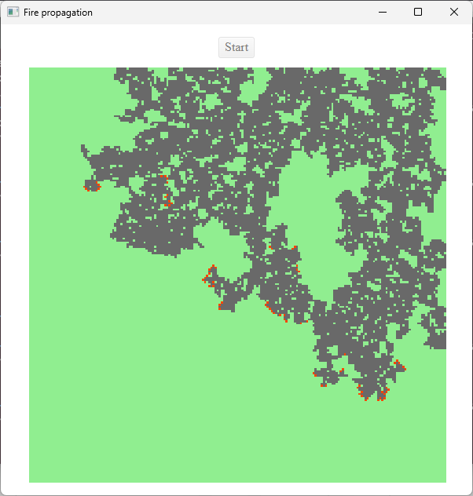

This program is my proposed solution to an exercise given by Ciril Group.

It simulates a forest fire propagation as a cell automaton.

# Installation

## Java backend

* Download [Java 21 JDK](https://www.oracle.com/java/technologies/downloads/#java21)
* Add the JDK path to your `%PATH%`/`$PATH` environment variable, e.g. `C:\Program Files\Java\jdk-21\bin`
* Download [JavaFX 21 SDK](https://gluonhq.com/products/javafx/)
* In a console, go to the `java` folder and run:
`javac --module-path %PATH_TO_FX% --add-modules javafx.controls,javafx.web -d ../out Main.java`,
replacing `%PATH_TO_FX%` with the path where you extracted the JavaFX SDK, or
setting that variable beforehand (`$PATH_TO_FX` on Unix) in your environment
variables.
* Copy the resources: `cp -r src/main/resources/* ../out`

## TypeScript/JavaScript frontend

* Install Node.js
* In a console, go to the `ts` folder and run `npm update`
* Run `npx tsc`

# Usage

In a console, go to the `out` folder and run:
 `java --module-path %PATH_TO_FX% --add-modules javafx.controls,javafx.web Main`,
replacing `%PATH_TO_FX%` like previously.

## Simulation configuration

The simulation can use a `config.properties` file, located in the class path,
to override some simulation parameters. You can edit it manually before
running the simulation.

Each line defines one property using the simple syntax:
`propertyName=propertyValue`

Here are the supported properties (all optional):
* `width`: integer, greater than 0, defining the number of columns of the grid.
* `height`: integer, greater than 0, defining the number of rows of the grid.
* `startingPointNum`: integer, between 1 and `width * height`, defining the number of initial fire cells.
* `propagationFactor`: double, between 0 and 1, defining the probability of a tile to be lit up by an adjacent fire, most interesting around 0.5.
* `timeStepMs`: integer, greater than 0, defining the duration of a time increment of the simulation, in milliseconds.